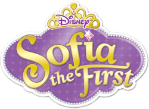

# Unit 7 - Creative Animation with The Theater Project

## Introduction

For this project, you will create an animation using The Theater that portrays a personal interest or solves a problem that you choose. Your program should demonstrate the object-oriented programming and software engineering skills and knowledge you have developed throughout the year.

## Requirements

Use your knowledge of object-oriented programming, data structures, and algorithms to create an animation using The Theater:

- **Use inheritance and polymorphism** – Create a superclass that represents shared attributes and behaviors with at least two subclasses that are more specific versions or variations of the superclass.
- **Method decomposition** – Use overloaded, overridden, and private methods to implement different versions of the same behavior, variations of a superclass behavior, and to improve code organization.
- **Use at least two data structures** - Use at least two 1D or 2D arrays or ArrayLists to store elements that are manipulated using loops and conditionals.
- **Implement one or more algorithms** – Implement one or more algorithms that use loops and two-way or multi-selection statements with compound Boolean expressions to analyze the data.
- **Create a visualization** – Create an animation that portrays a personal interest or solves a problem that you choose using objects, data structures, and methods.
- **Document your code** – Use comments to explain the purpose of the methods and code segments and note any preconditions and postconditions.

## Trello Board

## UML Diagram

## Video

## Project Description

As a Disney fan, I wanted to bring the magical world of Sofia the First to life through this code. This animation recreates a royal ball at Princess Sofia’s castle's ball room, where guests arrive with music one by one. My goal was to capture the charm of the show while demonstrating inheritance, polymorphism, and algorithmic design.

User-Story: As a Disney fan, I want recognizable visual elements (purple color scheme) to evoke the show's aesthetic.
I explain this by using hex colors in the code Sofia's purple for backgrounds Enchancia gold for accents.
